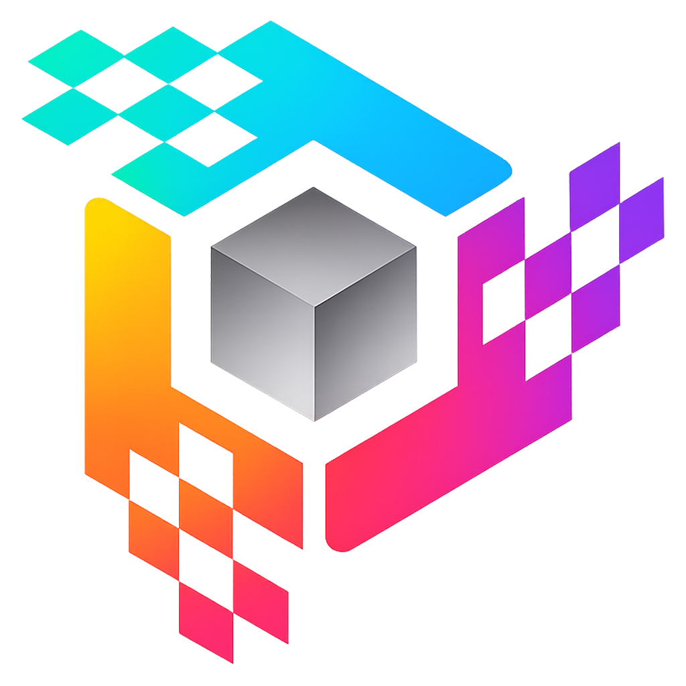

<p align="center">
  
</p>

<h1 align="center">Affinity Engine</h1>

<p align="center">
  A Game Boy Advance and Nintendo DS 3D engine with a Windows desktop editor.
</p>

<p align="center">
  <b>This project is in active development.</b> Features and APIs may change.
</p>

---

## Features

| | |
|---|---|
| **Software 3D Renderer** | Flat-shaded and textured polygon rasterizer with ARM ASM inner loops |
| **Dual Target** | Build for GBA or NDS from the same project |
| **OBJ Mesh Import** | Load .obj files with per-mesh culling, draw distance, LOD, and texture mapping |
| **Live Viewport** | Real-time perspective preview matching GBA/NDS rendering |
| **Tilemap Editor** | Draggable grid with sprite tile painting, object placement, and save/load |
| **Visual Script Nodes** | Event-driven node graph for game logic — key input, movement, animation, branching |
| **Collision System** | Pre-baked world-space collision with spatial grid, wall slide, floor snapping, and gravity |
| **OAM Sprites** | 8-directional animated sprites with LOD, running alongside 3D meshes |
| **One-Click Build** | Package a `.gba` or `.nds` ROM directly from the editor |
| **mGBA Integration** | Launch ROMs directly in mGBA from the editor |
| **Blender-style Tools** | G to grab, S to scale, X/Y/Z axis constraints with visual guides |
| **Mode 7 Floor** | HBlank affine floor rendering for non-mesh projects |

---

## Getting Started

### Prerequisites

- **Windows 10/11**
- **Visual Studio 2022+** (MSVC C++17)
- **CMake 3.16+**
- **devkitPro** with devkitARM + libtonc *(for GBA ROM packaging)*
- **mGBA** *(optional — for launching ROMs from the editor)*
- **Visual C++ Redistributable** *(required to run pre-built releases — [download](https://aka.ms/vs/17/release/vc_redist.x64.exe))*

### 1. Build the Editor

```bash
git clone https://github.com/myuu-151/Affinity.git
cd Affinity
cmake -S . -B build
cmake --build build --config Release
```

Run the editor:
```
build\Release\AffinityEditor.exe
```

### 2. Install devkitPro (GBA Toolchain)

You need devkitPro to compile GBA ROMs. The editor handles the build process — you just need the toolchain installed.

1. Download the installer from **[devkitpro.org](https://devkitpro.org/wiki/Getting_Started)**
2. Run the installer
3. Open the devkitPro MSYS2 terminal and install the GBA packages:

```bash
pacman -S devkitARM libtonc
```

4. Verify the environment variables are set *(the installer usually handles this)*:

```
DEVKITPRO=/opt/devkitpro
DEVKITARM=/opt/devkitpro/devkitARM
```

### 3. Build a GBA ROM

1. Open or create a project in the editor
2. Add meshes, sprites, and set up your scene
3. Click the **GBA Build** button

The editor exports `mapdata.h` and runs `make` automatically. The output ROM is:
```
gba_runtime/affinity.gba
```

<details>
<summary><b>Manual ROM build</b></summary>

If you want to build the ROM from the command line (after exporting from the editor):

```bash
cd gba_runtime
make
```

> `mapdata.h` must be exported from the editor first — it contains all mesh, sprite, map, and script data.

</details>

---

## Controls

### Editor

| Key | Action |
|-----|--------|
| **W / S** | Move forward / back |
| **A / D** | Rotate left / right |
| **Q / E** | Camera height down / up |
| **I / K** | Pitch up / down |
| **G** | Grab (translate) selected object |
| **S** | Scale selected object |
| **X / Y / Z** | Constrain to axis (during grab) |
| **R + drag** | Resize selected object |
| **Delete** | Delete selected object |
| **Right-click** | Place new object in viewport |
| **Ctrl+A** | Select all nodes |
| **Ctrl+C / V** | Copy / paste nodes (works across projects) |
| **Ctrl+Z** | Undo delete |

### Nodes

| Key | Action |
|-----|--------|
| **Space** | Add node at cursor |
| **Right-click** | Add node / node properties |
| **Delete** | Delete selected nodes |
| **Ctrl+A** | Select all nodes |
| **Ctrl+C / V** | Copy / paste nodes (works across projects) |
| **Ctrl+Z** | Undo delete |
| **Ctrl+G** | Group selected nodes |
| **Ctrl+Shift+G** | Ungroup selected group |
| **Alt + click** | Create annotation |
| **Double-click** | Enter group node |
| **Escape** | Exit group |
| **Scroll wheel** | Zoom canvas |
| **Middle mouse + drag** | Pan canvas |

---

## Project Structure

```
src/
  editor/        — ImGui editor (main loop, frame tick)
  viewport/      — Software 3D rasterizer and Mode 7 preview
  map/           — Mesh, sprite, and tilemap data types
  math/          — Fixed-point types, camera struct
  platform/gba/  — GBA ROM packaging (invokes devkitARM)
  platform/nds/  — NDS ROM packaging
gba_runtime/
  source/        — GBA runtime (software polygon renderer, OAM sprites, input)
  include/       — Generated mesh and map data header (mapdata.h)
nds_runtime/
  source/        — NDS runtime
thirdparty/
  glfw/          — Windowing
  imgui/         — UI framework
```

---

## License

MIT
